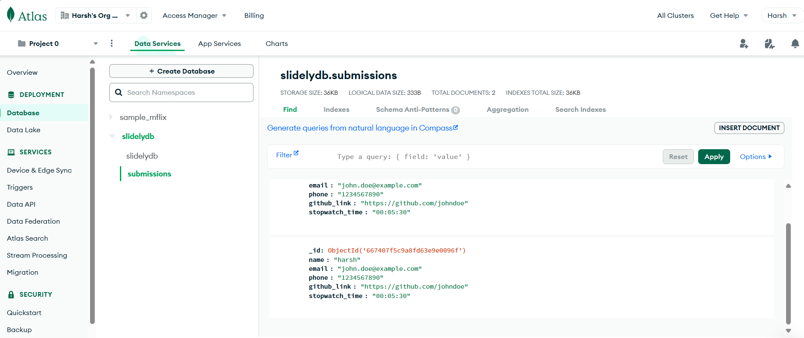

## watch the demo video 👉 [Demo Video](https://drive.google.com/file/d/1lnatM7KR2twpHj1vhA0Y-Lo5zMQbUnT6/view?usp=sharing)

# Slidely Server

## Introduction

**Server Side**it is a REST API server built with Node.js and Express and typescript, allowing users to submit and search data entries stored in a local JSON file (`db.json`). This server provides basic functionality for data submission and retrieval through a set of RESTful API endpoints.

this is a locally hosted project , however it's vercel hosting can be found here(`https://slidely-app-server.vercel.app/`) , please note only `/ping` and `/read` will work since vercel does not allow writing for serverless functions.
## Features

- Submit data entries
- read data entries
- delete data entries
- edit data entries
- Search data entries by specified fields like name, email etc

## Prerequisites

Before you begin, ensure you have the following installed on your system:

- [Node.js](https://nodejs.org/)
- [npm](https://www.npmjs.com/)

## Installation

1. Clone the repository:
   ```bash
   git clone https://github.com/Harshmori/SlidelyAppServer.git
   cd SlidelyAppServer
   
2. Install dependencies:
   ```bash
   npm install

## Running The Server

1. Compile TypeScript files:
   ```bash
   npx tsc

2. Start the server:
   ```bash
   node dist/server.js

## Using/Testing the API

1. /submit:
   ```bash
   curl -X POST http://localhost:3000/submit \
   -H "Content-Type: application/json" \
   -d '{"name": "John Doe", "email": "john.doe@example.com", "phone": "1234567890", "github_link": "https://github.com/johndoe", "stopwatch_time": "00:05:30"}'
   
2. /read:
   ```bash
   curl -X POST http://localhost:3000/read

3. /delete/index:
   ```bash
   curl -X DELETE http://localhost:3000/delete/0

4. /search/field_name/value:
   ```bash
   curl http://localhost:3000/search/email/john@example.com
   ```
5. /edit
   ```bash
   curl -X PUT http://localhost:3000/edit/0
   -H "Content-Type: application/json"
   -d "{\"name\":\"John Doe\",\"email\":\"john@example.com\",\"phone\":\"1234567890\",\"github_link\":\"https://github.com/johndoe\",\"stopwatch_time\":\"00:10:00\"}"


## Vercel or MongoDB Integration:
  the code for the vercel hosting is also given in the file in `vercel.json` which will be used in the vercel hosting(please know that vecrel will only allow reading and not the writing , so only `/ping` and `/read` will work)
   for using the mongodb as database whole script(`mongo-server.ts`) is given beside the server.ts , you just have to put your mongo db URL in place.



*mongodb database image*
  
